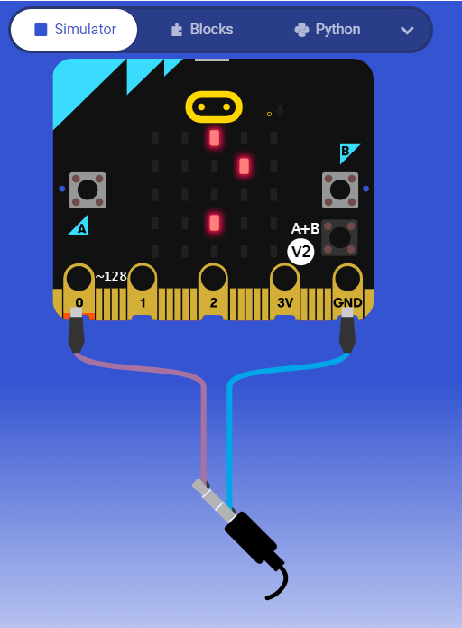

# Microbit Mini Projects
Welcome to this archive of some practice Microbit mini-projects!
 
This repo builds a Microbit community within Github and encourages people to enter/contribute to it.
 
### Feel free on contributing to this repo by:
- proposing new code/features
- issuing bugs and etc.

We respect your input!
  
If you do not have a Microbit to run the code, you can use the given Microbit simulation links.
  

