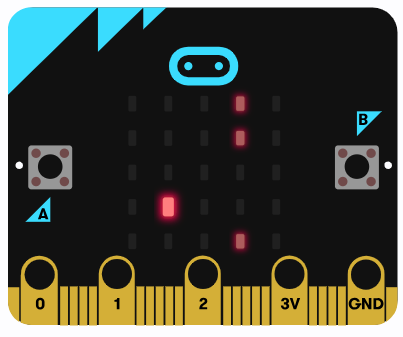

# Microbit Flappy Bird (JS)
It's classic Flappy Bird but on a Microbit.
 
Now, you get the chance to play this popular game on a 5x5 resolution screen.
 
If you do not have a microbit to play the game, feel free to play it on the [Microbit simulator](https://makecode.microbit.org/_5k1JvVR3CPzK).
 
## How to play
- Sprites
  - Bright single LED is the bird
  - Low brightness LEDs are part of the pipe.
- Operation
  - Press Button B to go up
- If the bird hits the ground or pipe, GAME OVER.
- Score increments by one each time the bird passes through a pipe/bar successfully.
- Enjoy!
  

