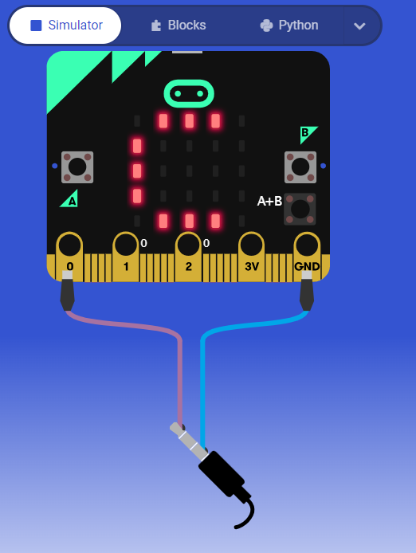

# Microbit Music Maker
Like Chrome Music Lab, develop your own "songs" by forming rests and various notes of different beat lengths!
 
But, you can easily and quickly do it on a Microbit!
 
IF YOU DO NOT HAVE A MICROBIT, feel free to run the program on this [Microbit Simulator](https://makecode.microbit.org/_Kt7bCxUJqEF2).
  
## How to use
- Press Button A once to add one a half-beat of the current, selected note.
  - Default current, selected note is low C.
- Changing current, selected note:
  - Press Pin 1 to go up a note (e.g. C1 => C#1 => D1).
  - Press Pin 2 to go down a note (e.g. F1 => E1 => D#1).
- Press Button B once to add one half-beat of rest
- Press both buttons simultaneously to play the song developed thus far.

 

